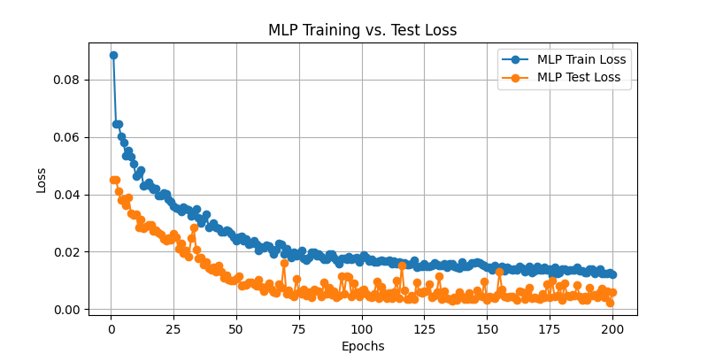
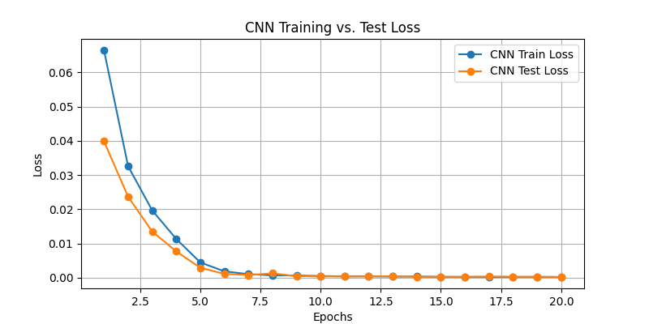
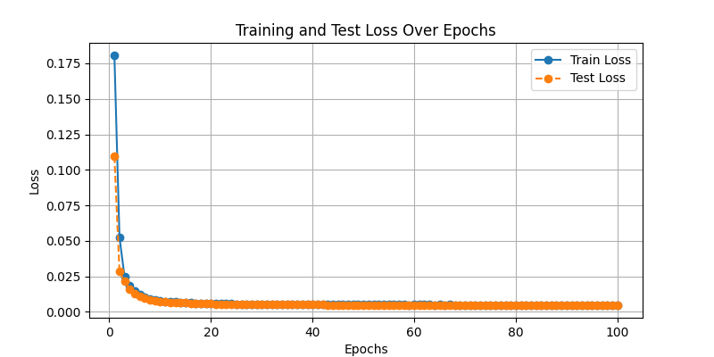
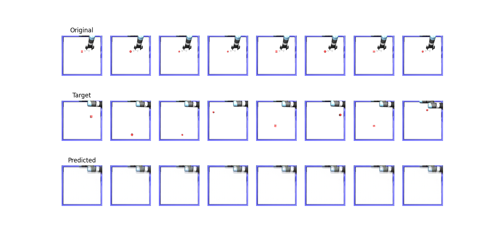

# Ömer Coşkun | 2024700024

## Dataset Overview

For **Part 1** and **Part 2**, the training and test data were generated via the `data_collection.py` script. However, this dataset was shuffled. For **Part 3**, where before and after images are needed for training, a new dataset was generated using the `data_collection_part3.py` script. The corresponding data can be found in the following folders:
- `test_data`
- `training_data`
- `test_data_part3`
- `training_data_part3`

---

## Part 1 Results

**Test Loss:** 0.006  
**MAE:** 0.0656  
**RMSE:** 0.0778  
**R²:** 0.8775  

---

## Part 2 Results

**Test Loss:** 0.0002  
**MAE:** 0.0077  
**RMSE:** 0.0144  
**R²:** 0.9958  

---

## Part 3 Results

**Test Loss:** 0.0048  

### Loss Graph:

### 8 Sample Predictions:

---

## Observations

It is evident that the model got stuck in a local minima and could not generate images containing the object. Multiple models were trained with different architectures. However, without proper trial and error and GPU support, it seems challenging to generate images with the object present (assuming the encoder/decoder structure was correct in my architecture).
